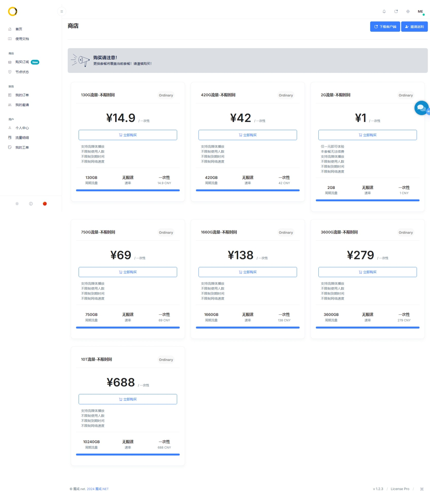

# [魔戒机场最新官网](https://mojie.app/register?aff=DZ3zqKF1)

## 活动

    魔戒 5周年活动开始啦 为期7天
    2025/11/11 00:00 到 2025/11/18 23:59 期间
    购买魔戒69元及以上套餐 将赠送 25%等额八戒余额
    购买后发送工单 将由后台为您创建账号 发放余额
    八戒 全IEPL专线 有不限时以及月付套餐 满足多种需求

## 支付

支持使用支付宝、微信、加密货币等方式购买流量

## 按量计费不限制到期时间、人数、网速等

仅访问外网时才会使用流量、稳定可靠。 ChatGPT、Gemini、Claude、YouTube、Netflix 等都可以正常登录使用

## 简介

魔戒机场，一家以按量付费套餐著称的VPN服务提供商，旨在为用户提供灵活、经济的上网体验。

按量付费套餐：所有套餐均无使用时限，根据实际流量消耗计费，性价比高，适合轻量级用户。

支持协议：提供V2ray和Trojan协议支持，确保稳定快速的连接。

节点覆盖：包括公网中转隧道和直连节点，服务区域包括香港、日本、台湾、新加坡、韩国、美国等热门地区，以及俄罗斯、德国、加拿大等冷门地区。

## 魔戒机场优惠码

建议关注 [魔戒机场官网](https://mojie.app/register?aff=DZ3zqKF1) 获取最新信息。

## 魔戒机场价格

| 流量        | 价格    | 付款方式 | 特性                     |
|-----------|-------|------|------------------------|
| 130G流量-不限时间 | ¥ 14.90 | 一次性  | 支持流媒体播放 不限制使用人数 不限制到期时间 不限制网络速度 |
| 420G流量-不限时间 | ¥ 42.00 | 一次性  | 支持流媒体播放 不限制使用人数 不限制到期时间 不限制网络速度 |
| 2G流量-不限时间   | ¥ 1.00  | 一次性  | 支持流媒体播放 不限制使用人数 不限制到期时间 不限制网络速度  |
| 750G流量-不限时间 | ¥ 69.00 | 一次性  | 支持流媒体播放 不限制使用人数 不限制到期时间 不限制网络速度 |
| 1660G流量-不限时间| ¥ 138.00| 一次性  | 支持流媒体播放 不限制使用人数 不限制到期时间 不限制网络速度 |
| 3600G流量-不限时间| ¥ 279.00| 一次性  | 支持流媒体播放 不限制使用人数 不限制到期时间 不限制网络速度 |
| 10T流量-不限时间  | ¥ 688.00| 一次性  | 支持流媒体播放 不限制使用人数 不限制到期时间 不限制网络速度  |
